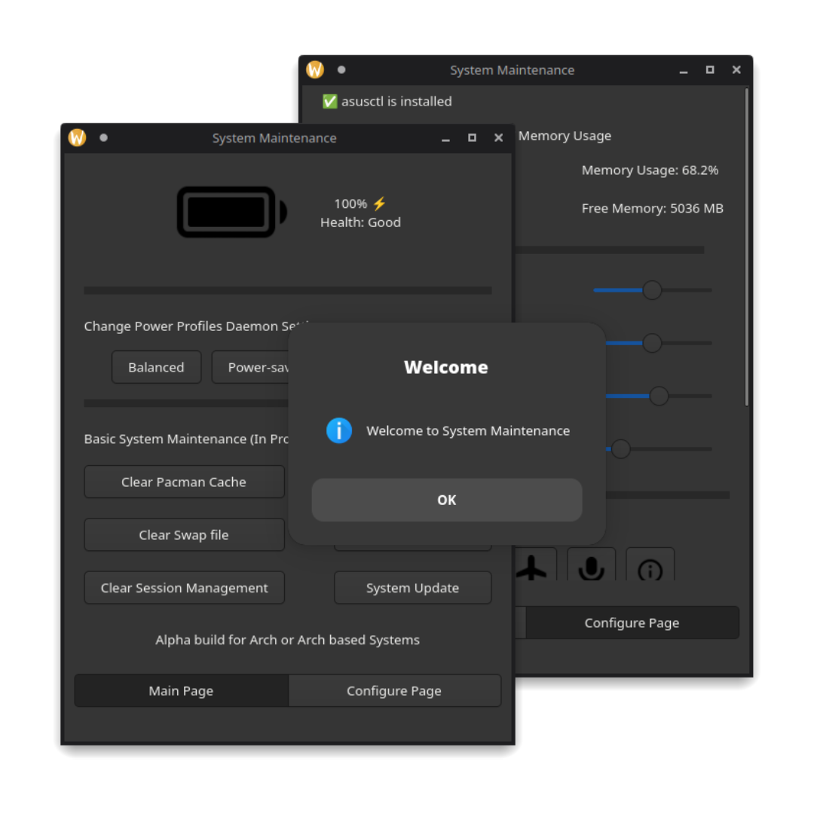

# SYSTEM MAINTAINENCE or SYS_MAIN

This is a system maintainence script that provides gui for basic system maintainence tasks like updating, upgrading, cleaning, etc. It is written in python and GTK4.

My objective is to provide a simple and easy to use GUI for system maintainence tasks. I'm building this project for my personal use and I'll be adding more features in the future.



## Features

- [x] Battery Status
- [x] Change Power Profiles (Only for laptops)
- [x] Update and Upgrade system packages (In progress)
- [x] Clean system cache (In progress)
- [x] Remove unnecessary / orphan files (In progress)
- [x] Provide a GUI for easy access (In progress)
- [ ] Provide a settings page for different laptops vendors example asusctl for Asus Laptops (Not built yet)

> Note: This project is still under development and some features may not work as expected. I'll be adding more features in the future. I'm also open to contributions.

## Installation

1. Clone the repository

```bash
git clone https://github.com/Fcatilizer/sys_main.git
```

2. Change directory

```bash
cd sys_main
```

3. Install the dependencies (for Arch Linux)

```bash
sudo pacman -S python-psutil zenity
```

4. Run the script

```bash
python app.py
```

> ⚠️ Currently I'm building it in Arch Linux. I'll be adding support for other distros soon. If you want to contribute, feel free to do so.
